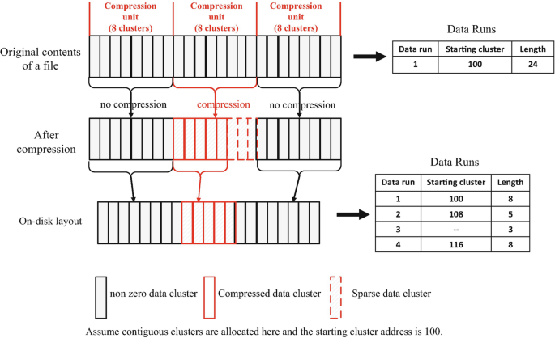

# File Systems in Windows 11: How Your Data Gets Organized

## Introduction

Let’s talk about file systems—the behind-the-scenes magic that keeps your files in order on Windows 11. As Microsoft’s latest operating system in 2025, Windows 11 juggles a few different file systems to make sure your data is stored, accessed, and protected the way it should be. Whether you’re saving a massive video file or plugging in a USB drive, the file system is what makes it all work. This essay breaks down the main file systems in Windows 11—NTFS, exFAT, FAT32, and ReFS—and what they bring to the table, plus how they’re tuned for today’s hardware.

## NTFS: The Heavy Hitter

NTFS, or New Technology File System, is the star of the show for Windows 11. It’s the default choice for your main drive, and for good reason—it’s powerful, secure, and built for modern PCs. It can handle gigantic files and partitions (we’re talking up to 16 exabytes, which is way more than most of us will ever need). NTFS comes with cool features like built-in file compression, encryption to lock down sensitive data, and access controls to decide who gets to see what.

On Windows 11, NTFS feels snappier than ever, especially if you’re using an SSD. It’s great at managing metadata, so things like searching for files or backing up your data don’t drag. Plus, it’s got journaling, which is like a safety net that tracks changes to your files, so if your PC crashes, you’re less likely to lose everything. If you’re using Windows 11, chances are your C: drive is running NTFS.

## exFAT: The Traveler’s Choice

Then there’s exFAT, short for Extended File Allocation Table, which is your go-to for portable storage like USB drives or SD cards. It’s lightweight and designed to play nice with all sorts of devices—think cameras, game consoles, or even a Mac. Like NTFS, it can handle huge files and partitions, making it perfect for tossing a 4K movie or a giant game installer onto a flash drive.

Windows 11 makes exFAT even faster, especially on newer USB 3.0 drives. It doesn’t have all the fancy security or recovery features of NTFS, but that’s the point—it’s simple and works everywhere. If you’ve ever plugged a USB into your Windows 11 laptop and it just worked, exFAT’s probably the reason.

## FAT32: The Old Reliable

FAT32 is the grandpa of file systems, still hanging around in Windows 11 for nostalgia and compatibility. It’s got some serious limitations—a 4GB max file size and 2TB max partition—which makes it feel like a relic next to NTFS or exFAT. But it’s still useful for older devices, like that ancient MP3 player or a car stereo that only reads FAT32-formatted drives.

In Windows 11, FAT32 is there when you need it, but it’s not winning any awards. If you’re formatting a tiny USB stick for a device that’s picky about file systems, FAT32’s your friend. Just don’t try to store a big video file on it—you’ll hit that 4GB wall fast.

## Making the Most of Modern Hardware

Windows 11’s file systems are built to shine on today’s tech, especially speedy SSDs and NVMe drives. NTFS and exFAT take advantage of things like TRIM, which keeps SSDs running smoothly by cleaning up unused data. The system also caches frequently used files to cut down on wait times. If you’ve got a setup with both an SSD for your OS and a big HDD for storage, Windows 11 makes sure they work together seamlessly.

For power users, features like Storage Spaces Direct use ReFS to combine multiple drives for better speed and reliability. It’s like having a mini data center in your PC, ensuring your files are both fast to access and safe from hardware failures.

## The Catch

Nothing’s perfect, and Windows 11’s file systems have their quirks. NTFS is awesome but can feel like overkill for a simple USB drive, and it’s a bit heavy for low-end devices. exFAT’s simplicity is great, but if you yank out a drive without ejecting it properly, you might lose data since it doesn’t have journaling. FAT32’s basically on life support, useful only for old-school compatibility. And ReFS? It’s great for pros but overcomplicated for most home users. Microsoft’s always tweaking things, but picking the right file system depends on what you’re doing.

## Conclusion

Windows 11’s file systems—NTFS, exFAT, FAT32, and ReFS—are like a toolbox, each one suited for a different job. NTFS runs the show for your main drive, exFAT keeps your portable storage hassle-free, FAT32 covers legacy needs, and ReFS steps up for serious data protection. With smart optimizations for modern hardware, Windows 11 makes sure your files are stored efficiently and accessed quickly, whether you’re on a budget laptop or a high-end gaming rig. It’s a solid lineup that keeps your data in check, no matter how you use your PC.
