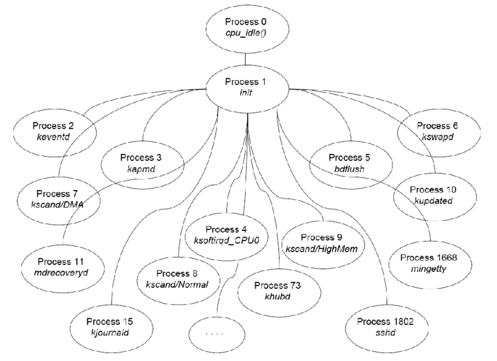
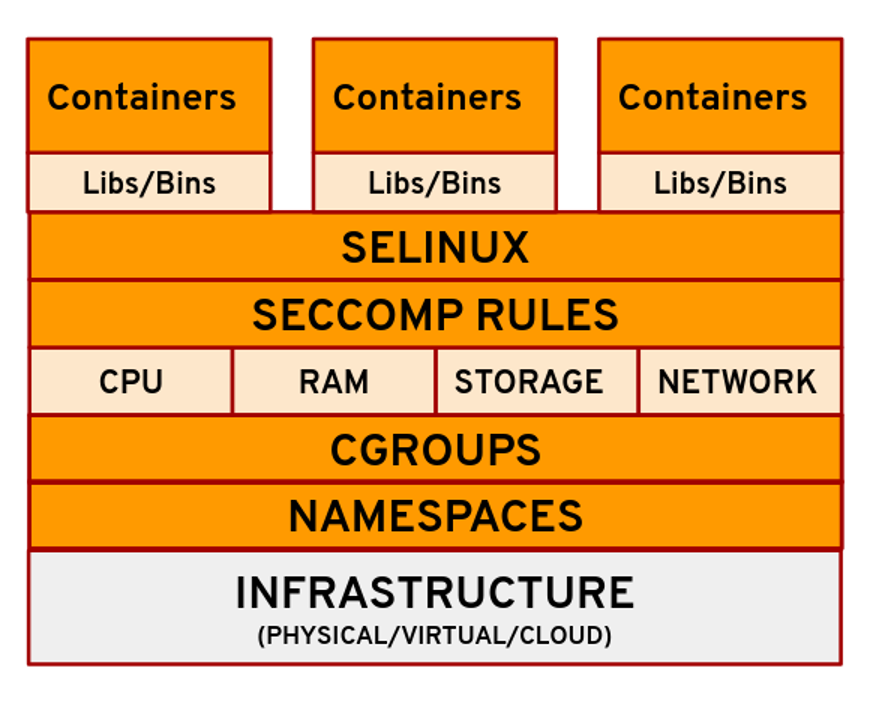

# Process and Thread Management in Modern Linux Operating Systems

Linux stands as a well-regarded open-source OS. Its strong management of processes and threads - the simple units of execution - is widely known. In this presentation, we examine how Linux handles this, with focus on the kernel structures.

## Processes and Threads: The Basics

A process is a program in execution with its own allocated memory. System calls like "fork()" and "exec()" dictate the process's duplication plus change. Threads represent simpler sections of a process - they use the same memory and resources while retaining separate contexts for execution.

## Process Management

Linux processes are in a hierarchy - it starts with `init` (PID 1). Systemd serves as the primary manager in current distributions like Ubuntu. The kernel monitors tasks in a linked list. It becomes simple to create, execute next to terminate tasks through the `exit()` command. Parent-child relationships are important for cleanup - lost processes go to init or systemd. For thread synchronization, Linux utilizes futexes - this reduces the kernel load in multithreaded software.

## Scheduling

The Completely Fair Scheduler (CFS) came out in kernel version 2.6.23 - it schedules time efficiently. It allocates CPU time and watches "virtual runtime" with a red-black tree structure - this makes sure each process receives fair access also keeps the system responsive. But for jobs needing immediate attention, real-time options like SCHED_FIFO and SCHED_RR prioritize them. These are suitable for systems such as Ubuntu Studio. Linux works well with symmetric multiprocessing (SMP) and affinity adjustments on multi-core CPUs, finding the best core for each thread also improving overall speed.

## Resource Management

Processes stay isolated with namespaces. Control groups (cgroups) set limits on CPU, memory as well as I/O use. Systemd makes use of cgroups to handle services. This increases resource control in distributions like Fedora. These options underscore the flexibility of Linux - it functions on both desktops and servers.

## Modern Enhancements

Linux gained ground with NPTL for threading plus CFS for scheduling. The latest kernel revisions, like 6.x, emphasize heterogeneous computing also less energy use. Security tools, like seccomp, restrict process actions - this boosts security in multi-task environments.

## Conclusion

Linux manages processes and threads with a combination of ease and strength - a single task structure benefits this.
