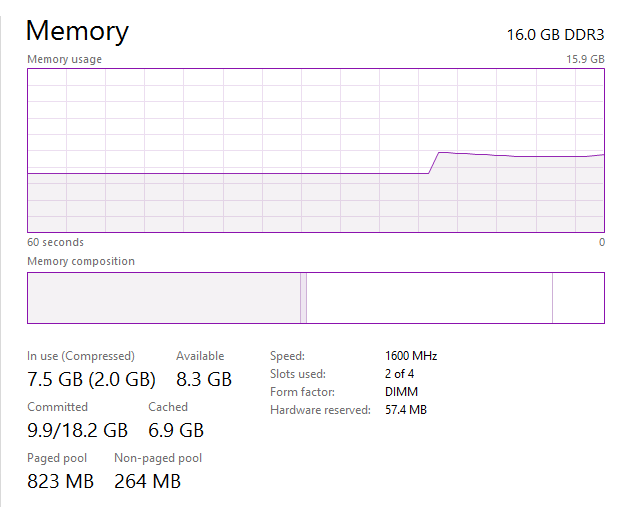

# Memory Management in Windows 11

## Introduction

Memory management is the backbone of any operating system, and Windows 11, Microsoft’s latest release as of 2025, brings some impressive upgrades to keep things running smoothly. It’s all about making sure your apps don’t crash, your system stays snappy, and your hardware’s potential isn’t wasted. This essay dives into how Windows 11 handles memory, from virtual memory and compression to page files and tweaks for cutting-edge hardware.

## Virtual Memory and Address Space

Windows 11 leans heavily on virtual memory to give every app its own chunk of space to play in, even if your actual RAM is stretched thin. It combines physical memory with disk storage (through something called the page file) to keep everything humming along. Compared to older versions, Windows 11 is sharper at juggling the demands of heavy apps like games or data-crunching programs.

The system uses a Memory Management Unit (MMU) to connect virtual addresses to actual RAM locations. It’s like a traffic cop directing data where it needs to go. For 64-bit apps, there’s a massive address space—think up to 128 terabytes in theory—which is a big deal for power users. Windows 11 also makes better use of large pages, which cuts down on the bookkeeping needed to manage memory for big applications.

## Memory Compression

One of the coolest tricks in Windows 11’s playbook is memory compression. Instead of dumping data to the slow hard drive when RAM gets tight, it squashes inactive memory pages and keeps them in RAM. This means your system can hold more data in memory without constantly leaning on the disk, which speeds things up.

The compression system is smart—it doesn’t hog too much CPU power while saving space. For instance, if you’re running low on memory, Windows 11 will zip up less-used data and tuck it away in a compressed corner of RAM. This is a lifesaver for budget devices like basic laptops or tablets that don’t have a ton of RAM to begin with.

## Page File Management

The page file is like an overflow tank for when your RAM can’t keep up. Windows 11 makes this process smarter with dynamic page file management, automatically tweaking the file’s size based on what your system’s doing and how much storage you’ve got. No need to fiddle with settings yourself—it just works.

For folks with SSDs, Windows 11 is careful not to wear out the drive with constant page file writes, which helps your hardware last longer. It even lets you spread page files across multiple drives if you’ve got a fancy setup, giving you a performance boost.

## Memory Optimization for Modern Hardware

Windows 11 is built to shine on today’s hardware, from beefy CPUs with tons of cores to lightning-fast NVMe drives. It’s especially good at handling hybrid processors, like Intel’s Alder Lake or AMD’s Ryzen chips, which mix high-performance and energy-saving cores. The system figures out which tasks need the big guns and which can coast on the efficient cores, keeping memory use in check.

There’s also this neat feature called DirectStorage, borrowed from Xbox, that lets games load assets straight to the GPU’s memory. This cuts down on RAM usage and makes games load faster, especially if you’ve got a speedy NVMe drive.

## Memory Management for Low-Power Devices

If you’re using a tablet or ultrabook, Windows 11 has your back. It aggressively frees up RAM by trimming down inactive apps, so the stuff you’re actually using gets priority. It also works with the power management system to cut memory use when your device is idle, which helps stretch battery life.

## Challenges and Limitations

Windows 11 isn’t perfect, though. If your system’s short on RAM, you might still hit slowdowns when you’re pushing it hard with multiple apps. Memory compression, while awesome, can tax the CPU a bit, which might be noticeable on cheaper devices. Microsoft’s been tweaking things with updates, but there’s always room to improve.

## Conclusion

Windows 11’s memory management is a big step up, with smarter virtual memory, slick compression, and page file systems that adapt on the fly. Add in optimizations for modern hardware and tricks like DirectStorage, and it’s clear Microsoft’s built a system that works for everything from gaming rigs to lightweight tablets. It’s not flawless, but it’s a solid foundation that makes the most of your hardware, no matter what you’re running.
