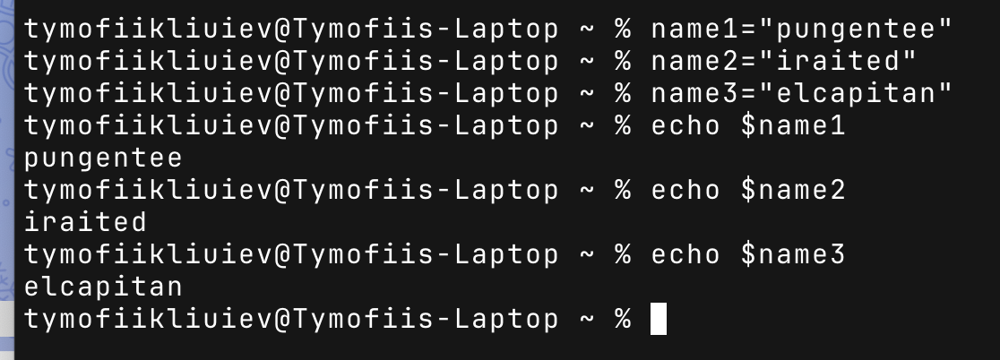
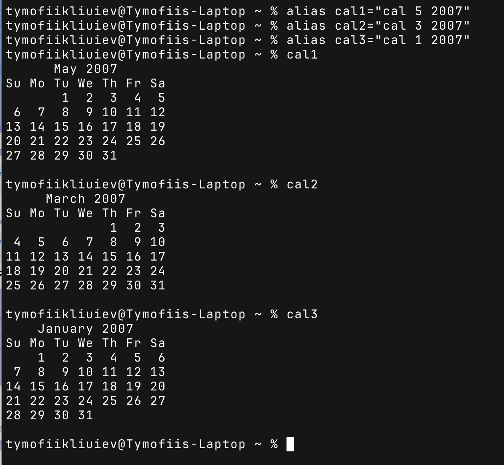
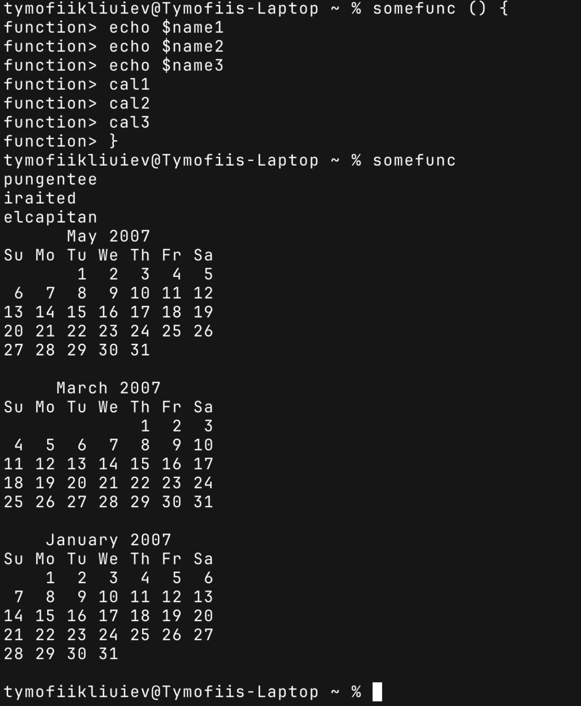
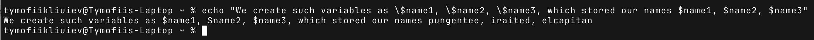
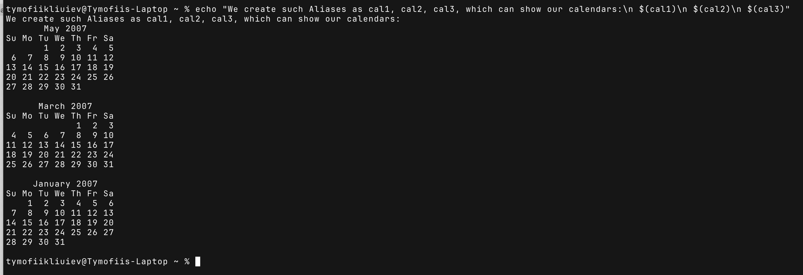
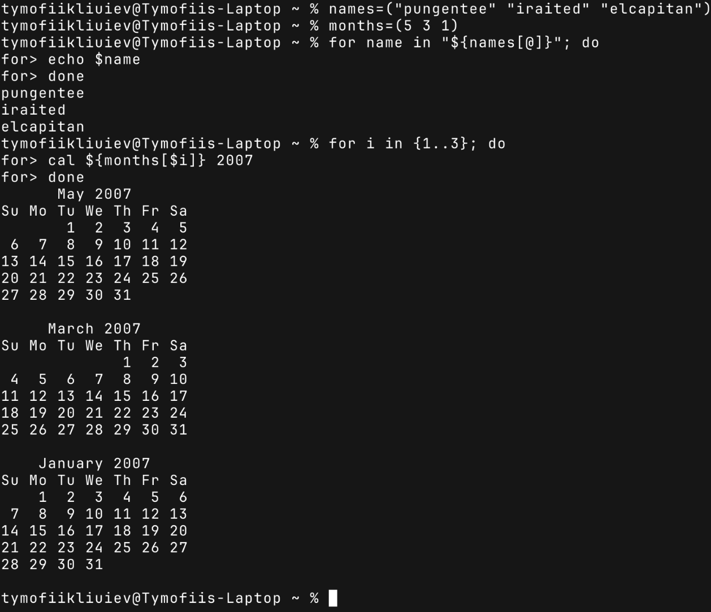
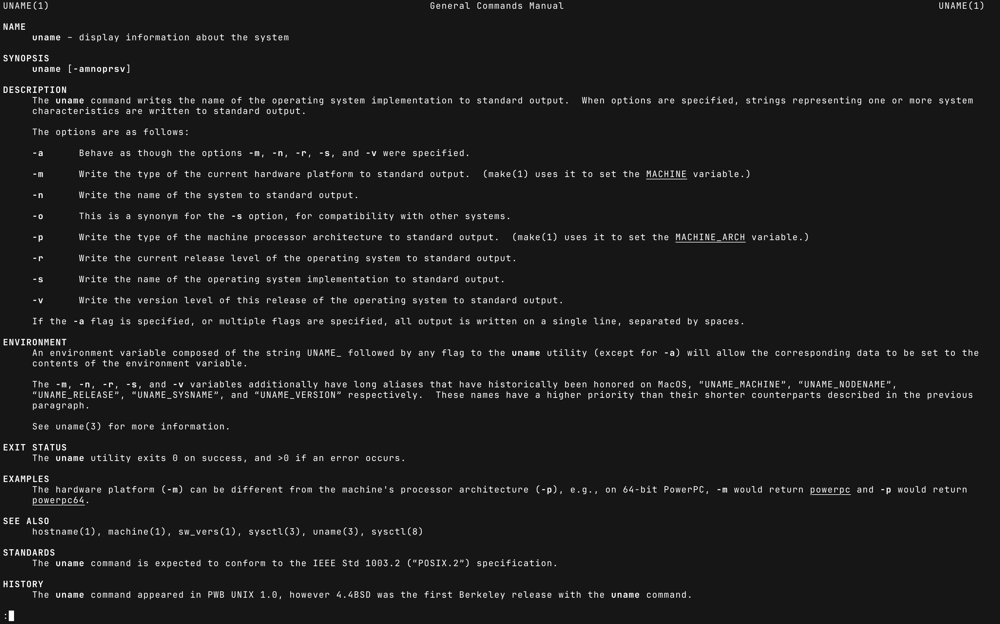
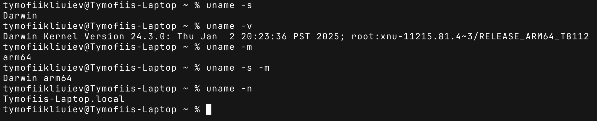

# Lab. #3

**Topic:** Introduction to basic CLI commands in Linux

**Purpose of the Work:**
Learn basic commands for working in CLI mode and basic text commands in terminal mode of various operating systems. Learn how to perform basic operations with files and directories, use commands to view, edit, and manage data through the command interface

## Main task

### 1.

### 2. Working with variables and aliases in the terminal

#### 2.1 Working with variables and aliases in the terminal

Created variables containing students' nicknames

Created aliases for displaying birthdays calendars

#### 2.2 Working with functions in the terminal

Created a function that displays students' names and years of birth

#### 2.3 Working with quotes (Quoting) in the terminal

#### 2.4 Working with Control Statements in the terminal

Task 2.1 and 2.2 ware completed using the loop

#### 2.5 Working with help commands (Man Pages) in the terminal

Manual was received for the command `uname`

Displaying information using different parameters of the `uname` command

## Control questions

## Conclusion

In the course of the laboratory work, the goal was achieved - to familiarize oneself with the basic commands of the CLI mode in Linux.The theoretical information on working with the shell command prompt was studied and practical skills in working with variables, aliases, functions, and control instructions in Bash were acquired. The acquired knowledge and skills are the basis for further studying Linux system administration and writing shell scripts.
