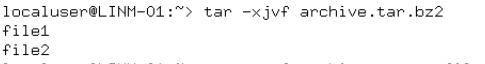

# Lab. #6

**Topic:** Linux commands for archiving and compressing data. Working with text

**Purpose of the Work:**

- Gaining practical skills in working with the Bash shell.
- Learn basic commands for archiving and compressing data.
- Familiarization with basic actions when working with text in the terminal.

## Answers to questions about preparing

### 1: Purpose of tar, xz, zip, bzip, gzip Commands

| Command | Purpose                                                                    | Main Parameters                                                                               | Installation                          |
| ------- | -------------------------------------------------------------------------- | --------------------------------------------------------------------------------------------- | ------------------------------------- |
| tar     | Creates and manages archives of files/directories, often with compression. | -c (create), -x (extract), -t (list), -v (verbose), -f (file), -z (gzip), -j (bzip2), -J (xz) | Pre-installed; `sudo apt install tar` |
| xz      | Compresses files with LZMA2 for high efficiency.                           | -d (decompress), -l (list), -c (stdout), -0 to -9 (level), -e (extreme)                       | `sudo apt install xz-utils`           |
| zip     | Creates compressed ZIP archives, cross-platform compatible.                | -r (recursive), -q (quiet), -0 to -9 (level)                                                  | `sudo apt install zip`                |
| bzip2   | Compresses files with Burrows-Wheeler algorithm, better than gzip.         | -d (decompress), -s (low memory), -1 to -9 (block size)                                       | `sudo apt install bzip2`              |
| gzip    | Compresses files with DEFLATE, fast and widely supported.                  | -d (decompress), -r (recursive), -l (list), -1 to -9 (level), -c (stdout)                     | `sudo apt install gzip`               |

### 2: Three Examples of Archiving and Compression

| Example | Command                                 | Description                                                           |
| ------- | --------------------------------------- | --------------------------------------------------------------------- |
| 1       | tar czvf archive.tar.gz /home/user/docs | Archives /home/user/docs and compresses with gzip into archive.tar.gz |
| 2       | tar cjvf archive.tar.bz2 /etc/udev      | Archives /etc/udev and compresses with bzip2 into archive.tar.bz2     |
| 3       | xz -9 largefile.txt                     | Compresses largefile.txt with xz at max level into largefile.txt.xz   |

### 3: Purpose of cat, less, more, head, and tail Commands

| Command | Purpose                                         | Main Parameters                                               | Installation            |
| ------- | ----------------------------------------------- | ------------------------------------------------------------- | ----------------------- |
| cat     | Displays file contents or concatenates files.   | -n (number lines), -b (number non-blank), -s (squeeze blanks) | Pre-installed           |
| less    | Views file contents page by page, scrollable.   | -N (line numbers), -S (chop lines), -q (quiet)                | `sudo apt install less` |
| more    | Shows file contents page by page, forward-only. | -d (prompt), -num (lines per page)                            | Pre-installed           |
| head    | Shows first few lines of a file (default 10).   | -n (lines), -c (bytes)                                        | Pre-installed           |
| tail    | Shows last few lines of a file (default 10).    | -n (lines), -f (follow)                                       | Pre-installed           |

### 4: How the Command Shell Works with Channels, Streams, and Filters

| Concept      | Description                                                                                                                     |
| ------------ | ------------------------------------------------------------------------------------------------------------------------------- |
| Streams      | Bash uses stdin (0) for input, stdout (1) for output, stderr (2) for errors.                                                    |
| Channels     | Redirection operators: > (stdout to file), >> (append), < (stdin from file), 2> (stderr), &> (both), \| (pipe stdout to stdin). |
| Filters      | Commands like grep or sort process input and output filtered data, often in pipes (e.g., cat file \| grep "text").              |
| How It Works | Shell processes commands, redirecting or piping streams as specified (e.g., cmd1 \| cmd2 sends cmd1 output to cmd2 input).      |

### 5: Purpose of the grep Command

| Command | Purpose                                                          | Main Parameters                                                                  | Installation                         |
| ------- | ---------------------------------------------------------------- | -------------------------------------------------------------------------------- | ------------------------------------ |
| grep    | Searches for patterns in files or input, outputs matching lines. | -i (ignore case), -r (recursive), -n (line numbers), -v (invert), -l (filenames) | Pre-installed; sudo apt install grep |


## Main task

### 2. Commands from NDG Linux Essentials (Chapter 9, 10)

| Command                           | Explanation                                                                                       |
| --------------------------------- | ------------------------------------------------------------------------------------------------- |
| `cat`                             | Concatenates and displays file contents.                                                          |
| `less`                            | Views file content interactively, allowing scrolling.                                             |
| `more`                            | Similar to `less`, but only allows forward navigation.                                            |
| `head`                            | Displays the first 10 lines of a file (default).                                                  |
| `tail`                            | Displays the last 10 lines of a file (default).                                                   |
| `>` (STDOUT redirection)          | Redirects output to a file, overwriting it.                                                       |
| `<` (STDIN redirection)           | Reads input from a file instead of standard input.                                                |
| `ls /one_dir /second_dir`         | Lists contents of multiple directories.                                                           |
| `ls /dir > file.txt`              | Saves the output of `ls /dir` to `file.txt`.                                                      |
| `cat > file.txt`                  | Creates or overwrites `file.txt`, allowing input from the terminal.                               |
| `cat file.txt`                    | Displays the contents of `file.txt`.                                                              |
| `sort`                            | Sorts lines of text in ascending order.                                                           |
| `sort -t`                         | Specifies a delimiter for sorting fields.                                                         |
| `sort -n`                         | Sorts numerically instead of lexicographically.                                                   |
| `sort -k`                         | Sorts based on a specific field/column.                                                           |
| `wc`                              | Counts lines, words, and characters in a file.                                                    |
| `wc -l`                           | Counts the number of lines in a file.                                                             |
| `cut`                             | Extracts specific sections of each line.                                                          |
| `cut -d: -f1,5-7 file.txt`        | Uses `:` as a delimiter and extracts fields 1 and 5-7 from `file.txt`.                            |
| `ls -l                            | cut -c1-11,50-`                                                                                   |
| `grep`                            | Searches for patterns in text.                                                                    |
| `grep 'c..e' file.txt`            | Finds lines where `c` is followed by any two characters and `e`.                                  |
| `grep [0-9]`                      | Finds lines containing any digit.                                                                 |
| `grep [a-d]`                      | Finds lines containing letters `a` to `d`.                                                        |
| `*` and `^` in `grep`             | `*` matches zero or more occurrences of the preceding character; `^` matches the start of a line. |
| `gzip`                            | Compresses files using GNU Zip.                                                                   |
| `gzip -d`                         | Decompresses a `.gz` file (same as `gunzip`).                                                     |
| `gzip -r`                         | Recursively compresses files in directories.                                                      |
| `gunzip`                          | Decompresses `.gz` files.                                                                         |
| `tar`                             | Archives files and directories.                                                                   |
| `tar -cvf archive.tar files`      | Creates an archive (`c` = create, `v` = verbose, `f` = filename).                                 |
| `tar -xvf archive.tar`            | Extracts an archive (`x` = extract).                                                              |
| `tar -zcvf archive.tar.gz files`  | Creates a compressed `.tar.gz` archive using gzip.                                                |
| `tar -jcvf archive.tar.bz2 files` | Creates a `.tar.bz2` archive using bzip2 compression.                                             |
| `tar -xzf archive.tar.gz`         | Extracts a `.tar.gz` archive.                                                                     |
| `zip archive.zip files`           | Compresses files into a `.zip` archive.                                                           |
| `zip -r archive.zip directory`    | Recursively compresses a directory into `.zip`.                                                   |
| `unzip archive.zip`               | Extracts a `.zip` archive.                                                                        |

### 3. Working with `tar` command

#### 1. Create a `.tar` file

```sh
tar -cvf archive.tar file.txt
```


Creates a `tar` archive named `archive.tar` containing `file.txt`.

#### 2. Create a `.tar` file with multiple files and directories

```sh
tar -cvf archive.tar file1.txt file2.txt directory/
```


Creates `archive.tar`, which includes multiple files and a directory.

#### 3. View the contents of a `.tar` file

```sh
tar -tvf archive.tar
```


Lists the files stored in `archive.tar` without extracting them.

#### 4. Extract the contents of a `.tar` file

```sh
tar -xvf archive.tar
```


Extracts all files from `archive.tar`.

#### 5. Create a `tar` archive compressed with `bzip2`

```sh
tar -cjvf archive.tar.bz2 file1.txt file2.txt directory/
```


Creates a compressed archive using `bzip2`.

#### 6. Extract a `tar.bz2` archive

```sh
tar -xjvf archive.tar.bz2
```



Extracts the contents of a `tar.bz2` archive.

#### 7. Create a `tar` archive compressed with `gzip`

```sh
tar -czvf archive.tar.gz file1.txt file2.txt directory/
```


Creates a compressed archive using `gzip`.

#### 8. Extract a `tar.gz` archive

```sh
tar -xzvf archive.tar.gz
```


Extracts the contents of a `tar.gz` archive.

## Conclusion

During the completion of this lab, various Linux commands for archiving, compressing, and working with text were explored. Practical skills in using tar, gzip, bzip2, and zip commands were developed, allowing efficient file management and data compression. Additionally, text manipulation commands like cat, grep, sort, and wc were applied to process and analyze textual data in the terminal. This lab provided valuable experience in handling files and working with command-line utilities essential for Linux system administration.
