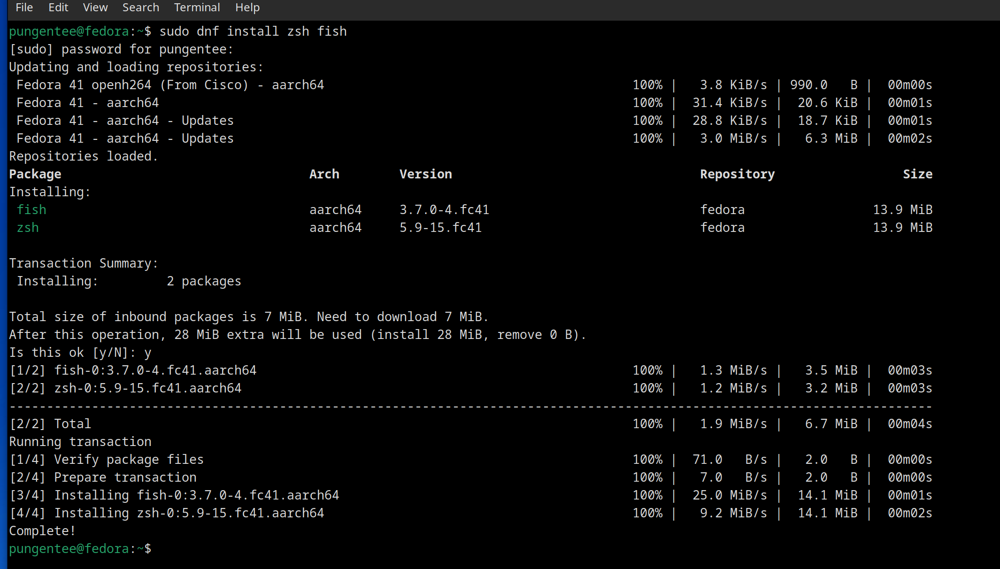
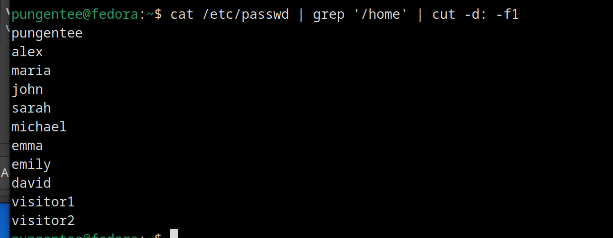

# Work Case #6

## Task 1. You need to install several command line interpreters in the operating system workspace (besides bash, you can choose 2 more)

I will install zsh and fish

### What commands can be used to do this

```sh
sudo dnf install zsh fish
```



### Briefly describe the capabilities of each of them

#### Zsh

- Advanced tab completion with context-sensitive suggestions
- Spelling correction for commands and arguments
- Shared command history across multiple sessions
- Plugin system for extended functionality

#### Fish

- Syntax highlighting as you type
- Web-based configuration interface
- Autosuggestions based on command history
- Clean scripting syntax without compatibility baggage

## Task 2. You need to create 10 new users in your system and assign them to groups

- Technical support (technical support, system administrators);
- Developers (developers, technical specialists in their field);
- Financiers (accounting, economists, etc.);
- Founders (management);
- Guests.

#### Create the groups

```sh
sudo groupadd techsupport
sudo groupadd sysadmin
sudo groupadd developers
sudo groupadd specialists
sudo groupadd accounting
sudo groupadd economists
sudo groupadd management
sudo groupadd guests
```

#### Create users and assign primary groups

```sh
sudo useradd -m -g techsupport -G sysadmin alex
sudo useradd -m -g techsupport -G sysadmin maria

sudo useradd -m -g developers -G specialists john
sudo useradd -m -g developers -G specialists sarah

sudo useradd -m -g accounting -G economists michael
sudo useradd -m -g accounting -G economists emma
sudo useradd -m -g accounting emily

sudo useradd -m -g management david

sudo useradd -m -g guests visitor1
sudo useradd -m -g guests visitor2
```

#### Set passwords for the new users

```sh
sudo passwd alex
sudo passwd maria
sudo passwd john
sudo passwd sarah
sudo passwd michael
sudo passwd emma
sudo passwd emily
sudo passwd david
sudo passwd visitor1
sudo passwd visitor2
```


