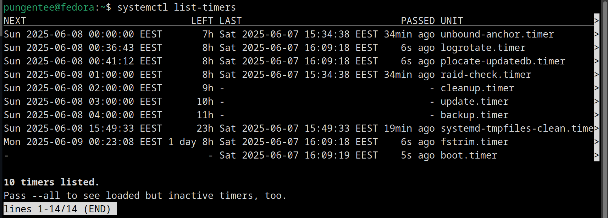
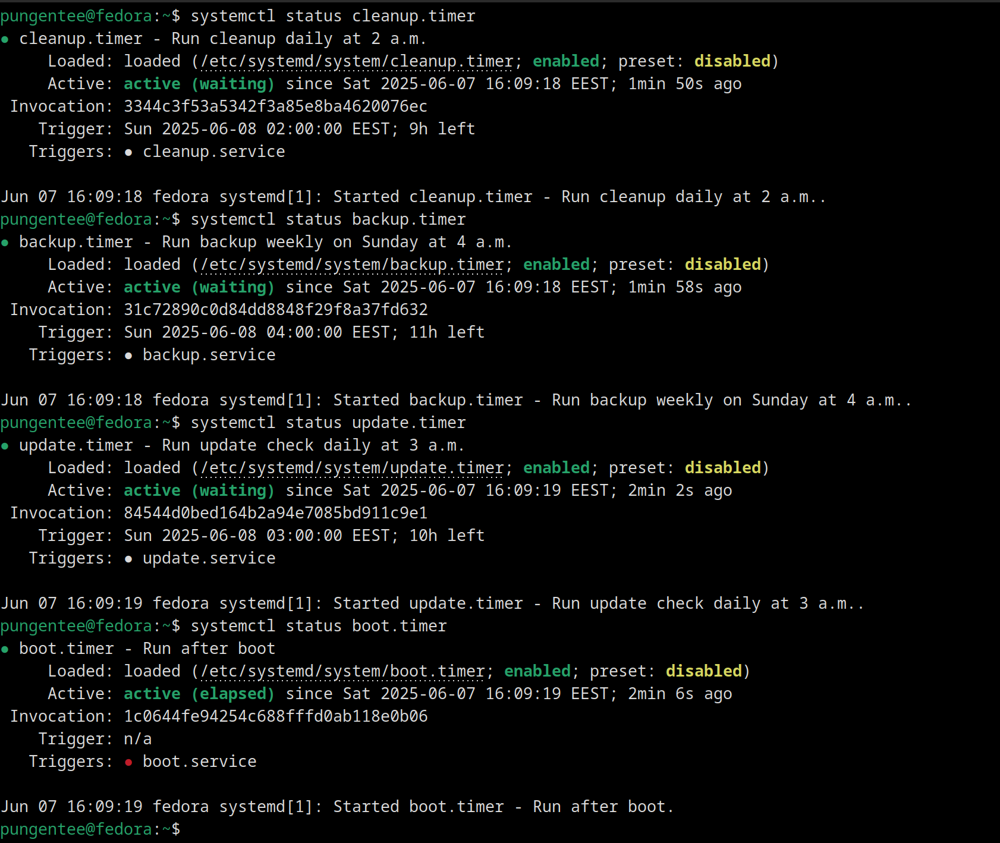
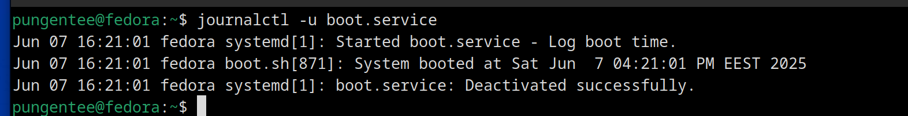

# Work Case #7

## Task 1.

### Task 1: Task Scheduling in Operating Systems

#### 1. Main Functions of a Task Scheduler

A task scheduler automates task execution in an OS, with key functions:
- **Scheduling**: Defines when tasks (scripts, programs) run, e.g., one-time or recurring.
- **Automation**: Executes tasks without manual input, e.g., backups, updates.
- **Triggers**: Supports time-based or event-based (e.g., system boot) execution.
- **Resource Management**: Allocates CPU/memory, avoids conflicts.
- **Logging**: Tracks task outcomes for debugging.
- **Permissions**: Controls user access to scheduling.

#### Comparison: Windows vs. Linux

| **Feature**               | **Windows (Task Scheduler)**                              | **Linux (Cron & Alternatives)**                          |
|---------------------------|----------------------------------------------------------|---------------------------------------------------------|
| **Tool**                  | Task Scheduler (GUI/CLI)                                 | Cron (CLI), Systemd Timers, Anacron, At                |
| **Ease of Use**           | Intuitive GUI, PowerShell for advanced                   | CLI-based, requires learning syntax                    |
| **Scheduling**            | Time/event-based, minute precision                      | Time-based (Cron), sub-second (Systemd), one-time (At) |
| **Recurring Tasks**       | Daily/weekly/monthly                                    | Minute/hour/day/month/weekday                          |
| **Logging**               | Event Viewer                                            | System logs (e.g., /var/log/cron)                      |
| **Permissions**           | Windows user accounts                                   | Crontab files, cron.allow/deny                         |
| **Scripting**             | Batch, PowerShell, executables                          | Shell scripts, binaries                                |
| **Alternatives**          | Third-party (e.g., Z-Cron)                              | Anacron (non-continuous), Systemd Timers, At           |

**Summary**:
- **Windows**: User-friendly GUI, integrates with Windows events, less flexible for complex schedules.
- **Linux**: Cron is powerful but CLI-based; alternatives like Systemd Timers add modern features.

#### 2. Cron in Linux: Principles and Configuration

**Principles**:
- **Daemon**: `crond` checks schedules every minute.
- **Crontab**: Stores tasks in user (`/var/spool/cron/crontabs/<username>`) or system-wide (`/etc/crontab`) files.
- **Syntax**: Six fields (minute, hour, day, month, weekday, command).
- **Permissions**: Managed via `/etc/cron.allow` or `/etc/cron.deny`.
- **Logging**: Outputs to `/var/log/syslog` or `/var/log/cron`.

**Cron Syntax**:
```
* * * * * /script.sh
```
- Fields: minute (0-59), hour (0-23), day (1-31), month (1-12), weekday (0-7), command.
- Special chars: `*` (any), `,` (list), `-` (range), `/` (step).
- Example: `0 5 * * 1 /backup.sh` runs at 5:00 AM every Monday.

**Configuration**:
1. **Edit Crontab**: `crontab -e` to add/edit tasks.
2. **System-Wide**: Edit `/etc/crontab` or use `/etc/cron.{hourly,daily,weekly,monthly}`.
3. **List Tasks**: `crontab -l`.
4. **Permissions**: Use `/etc/cron.allow` or `/etc/cron.deny`.
5. **Test**: Check logs for execution.

**Alternatives**:
- **Anacron**: For systems not always on, runs missed tasks (e.g., daily backups).
- **Systemd Timers**: Modern, event-driven, sub-second precision, integrates with Systemd.
- **At**: For one-time tasks, e.g., `echo "/script.sh" | at 5pm tomorrow`.

**Comparison**:
- **Anacron**: Ideal for laptops/servers with downtime, less precise than Cron.
- **Systemd Timers**: More flexible, supports complex triggers, replacing Cron in modern distros.
- **At**: Simple for single tasks, lacks recurring scheduling.

## Task 2.

### 1. Run a scheduled task at a specific time

Run a task once every day at a specified time.  

**Example:** Run a backup script every day at 8:00 AM.

```bash
0 8 * * * /home/user/scripts/backup.sh
````

Explanation:

* `0` minute
* `8` hour (8 AM)
* `* * *` means every day, every month, every day of the week

### 2. Run the same task twice a day

Run a task two times per day at specified times.
**Example:** Run a cleanup script at 8:00 AM and 6:30 PM every day.

```bash
0 8 * * * /home/user/scripts/cleanup.sh
30 18 * * * /home/user/scripts/cleanup.sh
```

Explanation:

* First line runs at 8:00 AM
* Second line runs at 6:30 PM (18:30)
* Both run every day

### 3. Run a task only on weekdays or weekends during a time range

Run a task every hour between 8 AM and 6 PM on weekdays (Monday to Friday).
**Example:** Run monitoring every hour on weekdays from 8:00 to 18:00.

```bash
0 8-18 * * 1-5 /home/user/scripts/monitor.sh
```

Explanation:

* `0` minute
* Hours from `8` to `18` (8 AM to 6 PM)
* Days of week `1-5` (Monday to Friday)

Run a task every hour between 8 AM and 6 PM on weekends (Saturday and Sunday).

```bash
0 8-18 * * 6,7 /home/user/scripts/weekend_task.sh
```

Explanation:

* Days of week `6,7` mean Saturday and Sunday

### 4. Run tasks with special frequencies

#### Once per year

Run a task at midnight on January 1st every year.

```bash
0 0 1 1 * /home/user/scripts/yearly_task.sh
```

Explanation:

* `0` minute, `0` hour (midnight)
* `1` day of month, `1` month (January)

#### Once per month

Run a task at midnight on the 1st day of each month.

```bash
0 0 1 * * /home/user/scripts/monthly_task.sh
```

#### Once per day

Run a task every day at midnight.

```bash
0 0 * * * /home/user/scripts/daily_task.sh
```

#### Every hour

Run a task at the start of every hour.

```bash
0 * * * * /home/user/scripts/hourly_task.sh
```

#### At system startup

Run a task every time the system boots up.

```bash
@reboot /home/user/scripts/startup_task.sh
```

Explanation:

* `@reboot` is a tag, that tells cron to run command on reboot

## Task 3. Using Systemd Timers as an Alternative to the Cron

### Environment

- Operating System: **Fedora**
- Alternative Scheduler: **Systemd timers**

### Timer 1: Daily Cleanup of Temporary Files

Action: **Removes files in /tmp older than 7 days**

Script: `/usr/local/bin/cleanup.sh`

```sh
#!/bin/bash
find /tmp -type f -mtime +7 -exec rm -f {} \;
echo "Cleanup completed at $(date)"
```

Service File: `/etc/systemd/system/cleanup.service`

```ini
[Unit]
Description=Cleanup temporary files

[Service]
ExecStart=/usr/local/bin/cleanup.sh
StandardOutput=journal
StandardError=journal
```

Timer File: `/etc/systemd/system/cleanup.timer`

```ini
[Unit]
Description=Run cleanup daily at 2 a.m.

[Timer]
OnCalendar=*-*-* 02:00:00
Persistent=true

[Install]
WantedBy=timers.target
```

### Timer 2: Weekly Directory Backup

Action: **Backs up `/home/user/documents` to `/backup/documents.tar.gz`**

Script: `/usr/local/bin/backup.sh`

```sh
#!/bin/bash
tar -czf /backup/documents.tar.gz /home/user/documents
echo "Backup completed at $(date)"
```

Service File: `/etc/systemd/system/backup.service`

```ini
[Unit]
Description=Backup documents

[Service]
ExecStart=/usr/local/bin/backup.sh
StandardOutput=journal
StandardError=journal
```

Timer File: `/etc/systemd/system/backup.timer`

```ini
[Unit]
Description=Run backup weekly on Sunday at 4 a.m.

[Timer]
OnCalendar=Sun *-*-* 04:00:00
Persistent=true

[Install]
WantedBy=timers.target
```

### Timer 3: Daily Update Check

Action: **Checks for system updates using dnf**

Script: `/usr/local/bin/update.sh`

```sh
#!/bin/bash
dnf check-update
echo "Update check completed at $(date)"
```

Service File: `/etc/systemd/system/update.service`

```ini
[Unit]
Description=Check for system updates

[Service]
ExecStart=/usr/local/bin/update.sh
StandardOutput=journal
StandardError=journal
```

Timer File: `/etc/systemd/system/update.timer`

```ini
[Unit]
Description=Run update check daily at 3 a.m.

[Timer]
OnCalendar=*-*-* 03:00:00
Persistent=true

[Install]
WantedBy=timers.target
```

### Timer 4: Post-Reboot Log

Action: **Logs the system boot time after each reboot**

Script: `/usr/local/bin/boot.sh`

```sh
#!/bin/bash
echo "System booted at $(date)"
```

Service File: `/etc/systemd/system/boot.service`

```ini
[Unit]
Description=Log boot time

[Service]
ExecStart=/usr/local/bin/boot.sh
StandardOutput=journal
StandardError=journal
```

Timer File: `/etc/systemd/system/boot.timer`

```ini
[Unit]
Description=Run after boot

[Timer]
OnBootSec=0

[Install]
WantedBy=timers.target
```

### Enabling and Starting the Timers

```sh
sudo systemctl enable cleanup.timer
sudo systemctl start cleanup.timer
sudo systemctl enable backup.timer
sudo systemctl start backup.timer
sudo systemctl enable update.timer
sudo systemctl start update.timer
sudo systemctl enable boot.timer
sudo systemctl start boot.timer
```

### Verifying and Monitoring

- List timers: `systemctl list-timers`

    

- Check status: `systemctl status <timer-name>.timer`

    

- View logs: `journalctl -u <service-name>.service`

    

## Conclusion

Task schedulers automate routine tasks in operating systems. We compared Windows Task Scheduler with Linux's Cron, which uses crontab files, and explored Systemd timers as a modern alternative. On Fedora, we scheduled daily cleanups, weekly backups, daily update checks, and post-reboot logging using Systemd timers. While Cron is simple and widely used, Systemd timers offer better integration, logging, and dependency management. The choice depends on system needs and user preferences.
