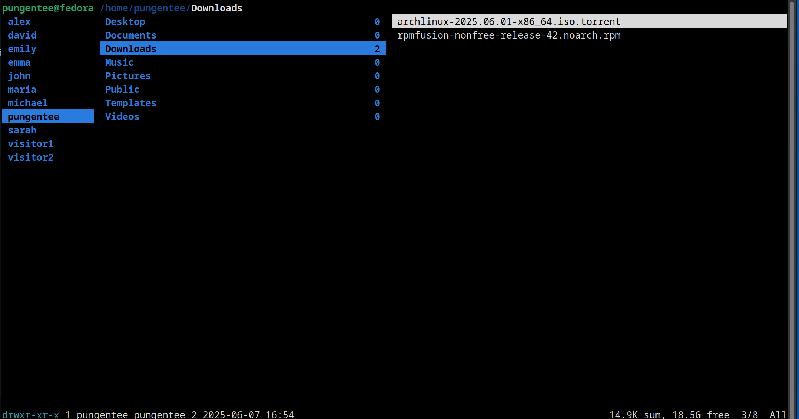
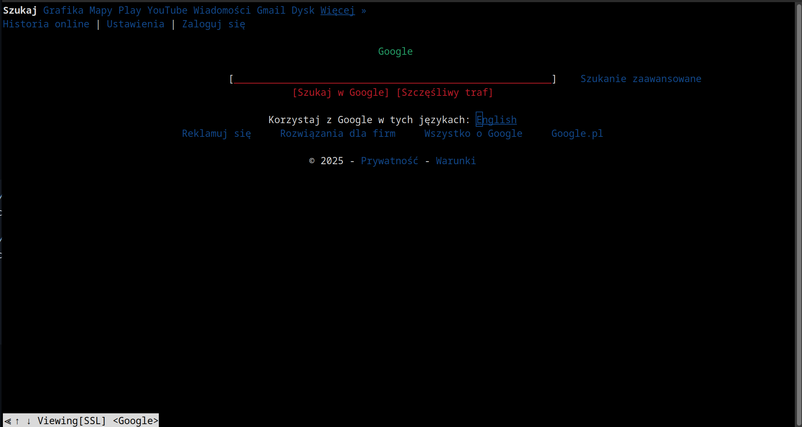
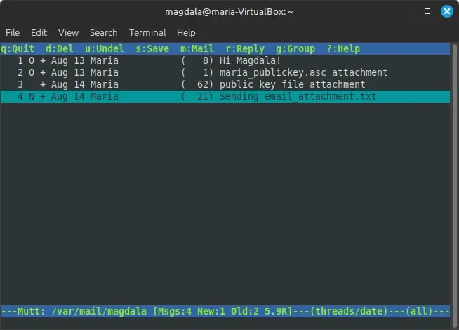
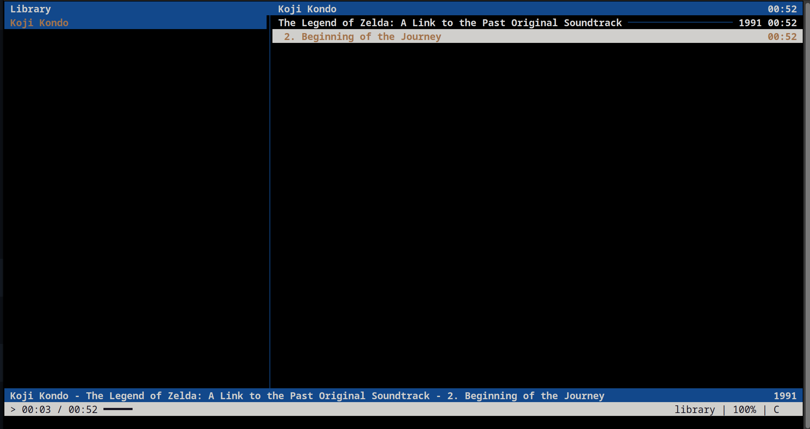
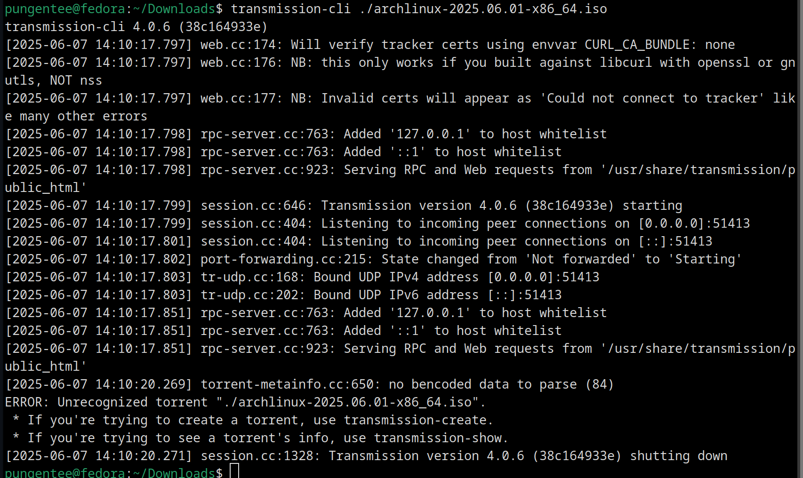
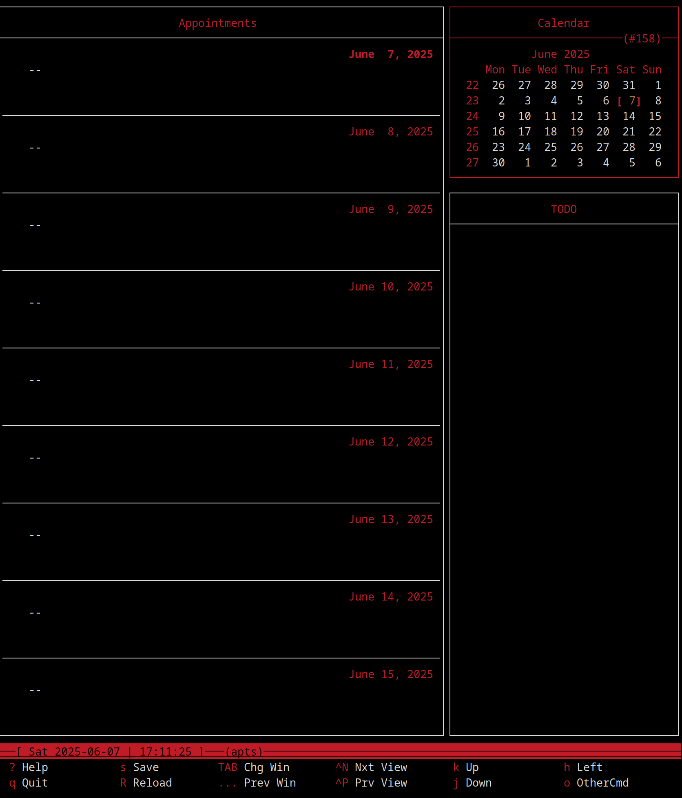
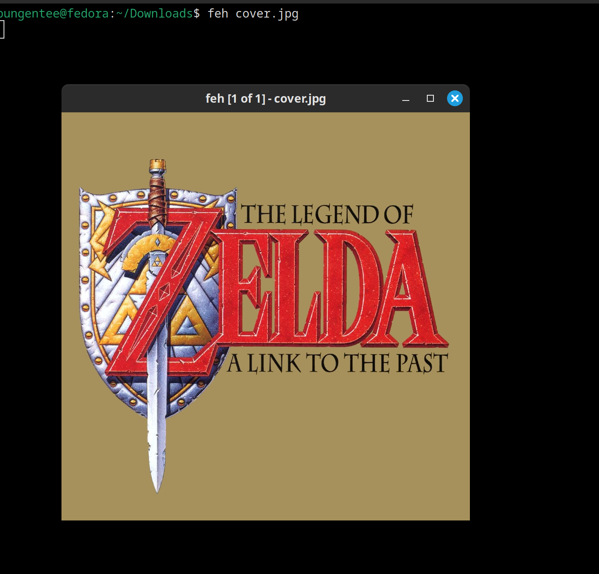

# Work Case #8

## Task 1. Terminal Tools

### Installation Commands

```bash
sudo dnf install ranger w3m mutt cmus transmission-cli calcurse feh tmux
```

### 1. Browse Files and Folders — **ranger**

```bash
ranger
```



Key controls:

- /k or ↑/↓ — navigate up/down
- h/l or ←/→ — go back/forward directories
- Enter — open file/enter directory
- Space — select file
- q — quit
- ? — help

### 2. Browse Web Pages — **w3m**

```bash
w3m https://www.google.com
```



Key controls:

- j/k or ↑/↓ — scroll up/down
- h/l or ←/→ — go back/forward
- Enter — follow link
- / — search
- q — quit

### 3. View Email — **mutt**

```bash
echo "set imap_url = 'imaps://username@imap.gmail.com:993/'" >> ~/.muttrc
echo "set imap_user = 'your-email@gmail.com'" >> ~/.muttrc
echo "set imap_pass = 'your-app-password'" >> ~/.muttrc
echo "set smtp_url = 'smtps://username@smtp.gmail.com:465/'" >> ~/.muttrc
echo "set smtp_user = 'your-email@gmail.com'" >> ~/.muttrc
echo "set smtp_pass = 'your-app-password'" >> ~/.muttrc
echo "set from = 'your-email@gmail.com'" >> ~/.muttrc
echo "set realname = 'Your Name'" >> ~/.muttrc

mutt
```



Key controls:

- j/k – navigate emails
- Enter – read email
- m – compose new email
- r – reply
- d – delete
- q – quit

### 4. Listen to Music — **cmus**

```bash
cmus
```



Key controls:

- c — pause/play
- b — next track
- z — previous track
- s — stop
- `+` — volume up
- `-` — volume down
- q — quit

### 5. Download Torrents — **transmission-cli**

```bash
transmission-cli /path/to/file.torrent
```



### 6. Schedule Events and Calendar — **calcurse**

```bash
calcurse
```



Key controls:

- Tab — switch between calendar and todo
- a — add appointment
- t — add todo item
- d — delete selected item
- e — edit selected item
- s — save and quit
- q — quit without saving
- +/- — next/previous day
- Enter — view appointment details

### 7. View Images — **feh**

```bash
feh image.jpg
```



Key controls:

- Space/n - next image
- Backspace/p - previous image
- +/- - zoom in/out
- f - fullscreen toggle
- q - quit

## Task 2.

### 1. Entering, Editing, and Deleting Text

#### Common text editors:

- `vi` / `vim` — terminal-based text editor, very popular and powerful  
- `nano` — easy-to-use terminal editor, user-friendly for beginners  
- `emacs` — highly extensible and powerful editor  
- `gedit` — graphical text editor for GNOME desktop environment  

#### Installing and using `vim` (usually pre-installed):

```bash
sudo apt-get update
sudo apt-get install vim
````

To edit a file with `vi`:

```bash
vi filename.txt
```

**Basic `vi` commands:**

* Press `i` to enter insert mode (start editing)
* Press `Esc` to exit insert mode
* Type `:w` and press Enter to save changes
* Type `:q` and press Enter to quit
* Type `:wq` and press Enter to save and quit
* Type `:q!` and press Enter to quit without saving

### 2. Monitoring Processes and System Resources

#### Common tools:

* `top` — terminal-based real-time system monitor
* `htop` — improved interactive process viewer (not always installed by default)
* `ps` — snapshot of current processes
* `glances` — advanced system monitoring tool
* `gnome-system-monitor` — graphical system monitor for GNOME desktop

#### Installing and using `htop`:

```bash
sudo apt-get update
sudo apt-get install htop
```

To start `htop`:

```bash
htop
```

`htop` provides:

* Real-time CPU and memory usage
* List of running processes with user, CPU%, memory%, and process tree
* Interactive process management (kill, renice)


## Task 3.

### 1. Steam Locomotive for Travel Dreamers

If you’re dreaming of a journey, the `sl` command displays an ASCII steam locomotive chugging across your terminal, a nod to travel and adventure.
- **Install**: `sudo apt install sl`
- **Run**: `sl`
- **Options**:
  - `sl -l`: Smaller, longer train.
  - `sl -F`: Flying train.
  - `sl -a`: Adds screaming passengers for extra drama.
- **Note**: Created to poke fun at mistyping `ls`, it’s a lighthearted reminder to slow down. Not all distros (e.g., Fedora) include it by default

### 2. Star Wars for Sci-Fi Fans

Star Wars fans can watch an ASCII rendition of *Star Wars Episode IV* in the terminal.
- **Run**: `telnet towel.blinkenlights.nl`
- **Details**: Connects to a remote server displaying an animated ASCII version of the movie. Requires an internet connection and `telnet` installed (`sudo apt install telnet`). Exit with `Ctrl+]`, then type `close`. A fun, nostalgic treat for fans, though not pre-installed

### 3. Cow Conversations for Animal Lovers

The `cowsay` command lets an ASCII cow "speak" your text, perfect for animal enthusiasts.
- **Install**: `sudo apt install cowsay`
- **Run**: `cowsay "Hello, World!"`
- **Variations**:
  - Use `-f` to change characters, e.g., `cowsay -f tux "I'm a penguin!"` for Tux the Linux mascot.
  - List options: `cowsay -l` or `ls /usr/share/cowsay/cows` (includes dragons, Tux, etc.).
  - Combine with `fortune` for witty quotes: `fortune | cowsay`.
- **Note**: Available on most distros, with `xcowsay` for a GUI version

### 4. Other Fun Terminal Interactives

Here are additional Easter eggs to spark joy:
- **Matrix Effect**: Feel like a hacker with `cmatrix`.
  - **Install**: `sudo apt install cmatrix`
  - **Run**: `cmatrix`
  - **Details**: Displays falling green characters like in *The Matrix*. Exit with `Ctrl+C`
- **Tetris in Terminal**: Play a classic game.
  - **Install**: `sudo apt install bastet`
  - **Run**: `bastet`
  - **Details**: A simple Tetris clone, addictive and fun
- **Apt Moo**: A cheeky cow in Debian-based systems.
  - **Run**: `apt-get moo`
  - **Details**: Displays an ASCII cow with “Have you mooed today?” No installation needed on Debian/Ubuntu
- **Reverse Text**: Play with text manipulation.
  - **Run**: `echo "Hello" | rev`
  - **Details**: Outputs “olleH”. Simple but amusing for quick breaks
- **ASCII Fire**: Light up your terminal.
  - **Install**: `sudo apt install libaa-bin`
  - **Run**: `aafire`
  - **Details**: Shows an ASCII fireplace, perfect for a cozy vib

## Conclusion

The Linux terminal proves highly versatile, handling GUI-like tasks (e.g., file management with mc, web browsing with lynx, music with cmus), system administration (e.g., vim for editing, htop for monitoring), and fun Easter eggs (sl, cowsay, cmatrix). These tools enable efficient, lightweight operations and add playful engagement, making the terminal a powerful and enjoyable environment for all users, even on resource-limited systems.
